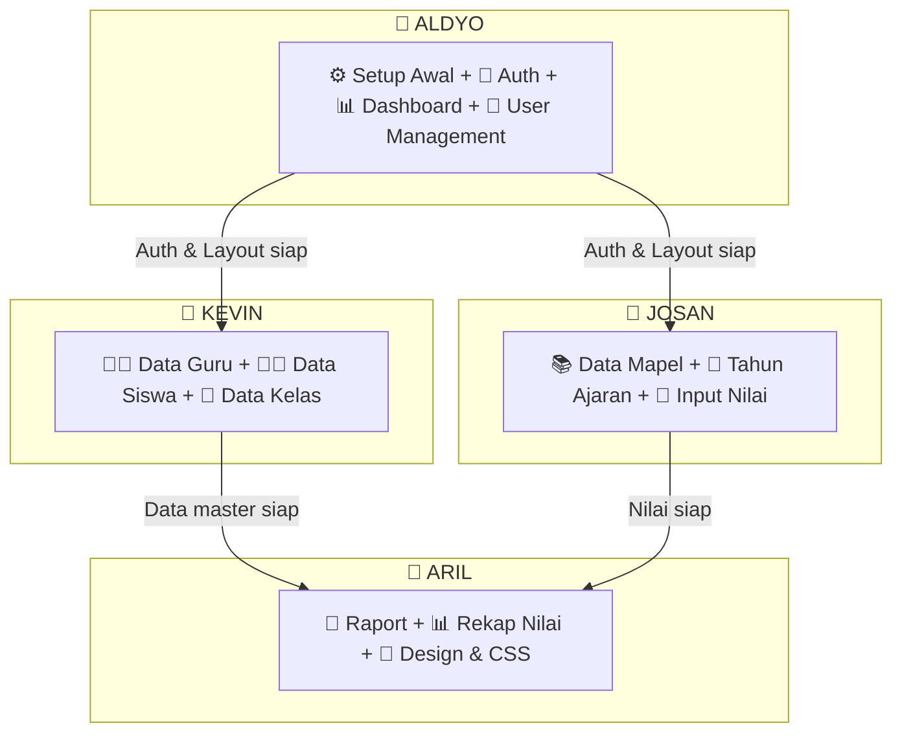
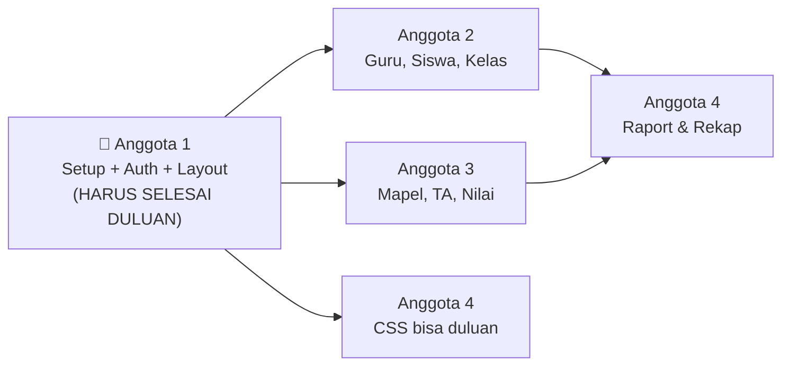

# Pembagian Job Desk 

> Setiap anggota mengerjakan **full-stack** (Backend + Frontend) untuk fitur yang ditangani.

---

## Overview Pembagian



---

## 👤 ALDYO — Setup Awal + Auth + Dashboard + User Management

**Fitur**: Menyiapkan fondasi project, sistem login/logout, dashboard, dan kelola user.

### Backend

| # | Tugas | File |
|---|---|---|
| 1 | Setup MySQL, konfigurasi `.env` | `.env`, `config/database.php` |
| 2 | Install & setup Laravel Sanctum | `composer.json`, `config/sanctum.php` |
| 3 | Setup CORS untuk frontend | `config/cors.php` |
| 4 | Modifikasi migration `users` — tambah kolom `role` | `migrations/create_users_table.php` |
| 5 | Update Model `User.php` — HasApiTokens, role, relasi | `app/Models/User.php` |
| 6 | Buat `RoleMiddleware` — cek admin/guru | `app/Http/Middleware/RoleMiddleware.php` |
| 7 | Buat `AuthController` — login, logout, me | `Controllers/Api/AuthController.php` |
| 8 | Buat `DashboardController` — statistik | `Controllers/Api/DashboardController.php` |
| 9 | Buat `UserController` — CRUD user & assign role | `Controllers/Api/UserController.php` |
| 10 | Setup `routes/api.php` — route auth, dashboard, users | `routes/api.php` |
| 11 | Buat `DatabaseSeeder` — seed admin default | `database/seeders/DatabaseSeeder.php` |

### Frontend

| # | Tugas | File |
|---|---|---|
| 12 | Install dependencies (react-router-dom, axios, react-icons, react-toastify) | `package.json` |
| 13 | Setup Axios instance + interceptor token | `src/api/axios.js` |
| 14 | Buat `AuthContext` — state login, token, role | `src/context/AuthContext.js` |
| 15 | Buat `ProtectedRoute` component | `src/components/common/ProtectedRoute.js` |
| 16 | Buat `Sidebar` navigation | `src/components/Layout/Sidebar.js` |
| 17 | Buat `Header` bar | `src/components/Layout/Header.js` |
| 18 | Buat `MainLayout` wrapper | `src/components/Layout/MainLayout.js` |
| 19 | Buat halaman **Login** | `src/pages/Login.js` |
| 20 | Buat halaman **Dashboard** | `src/pages/Dashboard.js` |
| 21 | Buat halaman **User Management** | `src/pages/users/UserList.js` |
| 22 | Setup Router di `App.js` | `src/App.js` |

### Reusable Components (Dipakai Semua Anggota)

| # | Tugas | File |
|---|---|---|
| 23 | Buat `LoadingSpinner` | `src/components/common/LoadingSpinner.js` |
| 24 | Buat `ConfirmDialog` | `src/components/common/ConfirmDialog.js` |

### Output: ~22 files

---

## 👤 KEVIN — Data Guru + Data Siswa + Data Kelas

**Fitur**: Full CRUD data guru, siswa, dan kelas (backend API + frontend page).

### Backend

| # | Tugas | File |
|---|---|---|
| 1 | Buat migration tabel `guru` | `migrations/create_guru_table.php` |
| 2 | Buat migration tabel `kelas` | `migrations/create_kelas_table.php` |
| 3 | Buat migration tabel `siswa` | `migrations/create_siswa_table.php` |
| 4 | Buat migration tabel `guru_mapel` (pivot) | `migrations/create_guru_mapel_table.php` |
| 5 | Buat Model `Guru.php` + relasi | `app/Models/Guru.php` |
| 6 | Buat Model `Kelas.php` + relasi | `app/Models/Kelas.php` |
| 7 | Buat Model `Siswa.php` + relasi | `app/Models/Siswa.php` |
| 8 | Buat `GuruController` — full CRUD | `Controllers/Api/GuruController.php` |
| 9 | Buat `KelasController` — full CRUD | `Controllers/Api/KelasController.php` |
| 10 | Buat `SiswaController` — full CRUD + filter kelas | `Controllers/Api/SiswaController.php` |
| 11 | Tambah routes guru, kelas, siswa ke `api.php` | `routes/api.php` (tambahkan) |
| 12 | Seed sample data guru, kelas, siswa | `database/seeders/` |

### Frontend

| # | Tugas | File |
|---|---|---|
| 13 | Buat `DataTable` component (reusable) | `src/components/common/DataTable.js` |
| 14 | Buat `Modal` component (reusable) | `src/components/common/Modal.js` |
| 15 | Buat halaman **Guru List** | `src/pages/guru/GuruList.js` |
| 16 | Buat `GuruForm` | `src/components/forms/GuruForm.js` |
| 17 | Buat halaman **Siswa List** | `src/pages/siswa/SiswaList.js` |
| 18 | Buat `SiswaForm` | `src/components/forms/SiswaForm.js` |
| 19 | Buat halaman **Kelas List** | `src/pages/kelas/KelasList.js` |
| 20 | Buat `KelasForm` | `src/components/forms/KelasForm.js` |

### Output: ~20 files

---

## 👤 JOSAN — Data Mapel + Tahun Ajaran + Input Nilai

**Fitur**: Full CRUD data mata pelajaran & tahun ajaran, serta fitur input nilai siswa.

### Backend

| # | Tugas | File |
|---|---|---|
| 1 | Buat migration tabel `mata_pelajaran` | `migrations/create_mata_pelajaran_table.php` |
| 2 | Buat migration tabel `tahun_ajaran` | `migrations/create_tahun_ajaran_table.php` |
| 3 | Buat migration tabel `nilai` | `migrations/create_nilai_table.php` |
| 4 | Buat Model `MataPelajaran.php` + relasi | `app/Models/MataPelajaran.php` |
| 5 | Buat Model `TahunAjaran.php` + relasi + scope active | `app/Models/TahunAjaran.php` |
| 6 | Buat Model `Nilai.php` + relasi + hitungNilaiAkhir() + getPredikat() | `app/Models/Nilai.php` |
| 7 | Buat `MataPelajaranController` — full CRUD | `Controllers/Api/MataPelajaranController.php` |
| 8 | Buat `TahunAjaranController` — CRUD + toggle active | `Controllers/Api/TahunAjaranController.php` |
| 9 | Buat `NilaiController` — index, store, update | `Controllers/Api/NilaiController.php` |
| 10 | Tambah routes mapel, tahun-ajaran, nilai ke `api.php` | `routes/api.php` (tambahkan) |
| 11 | Seed sample data mapel SD, tahun ajaran | `database/seeders/` |

### Frontend

| # | Tugas | File |
|---|---|---|
| 12 | Buat halaman **Mata Pelajaran List** | `src/pages/mapel/MapelList.js` |
| 13 | Buat `MapelForm` | `src/components/forms/MapelForm.js` |
| 14 | Buat halaman **Tahun Ajaran List** | `src/pages/tahun-ajaran/TahunAjaranList.js` |
| 15 | Buat `TahunAjaranForm` | `src/components/forms/TahunAjaranForm.js` |
| 16 | Buat halaman **Input Nilai** — pilih kelas, mapel, input grid | `src/pages/nilai/InputNilai.js` |
| 17 | Buat `NilaiForm` | `src/components/forms/NilaiForm.js` |

### Output: ~17 files

---

## 👤 ARIL — Raport + Rekap Nilai + Design & CSS

**Fitur**: Halaman raport siswa, rekap nilai kelas, cetak raport, dan seluruh desain visual.

### Backend

| # | Tugas | File |
|---|---|---|
| 1 | Tambah method `raport()` di `NilaiController` — semua nilai 1 siswa 1 semester | `Controllers/Api/NilaiController.php` (tambahkan) |
| 2 | Tambah method `rekap()` di `NilaiController` — rekap & ranking kelas | `Controllers/Api/NilaiController.php` (tambahkan) |
| 3 | Tambah routes raport & rekap ke `api.php` | `routes/api.php` (tambahkan) |

### Frontend — Halaman Raport

| # | Tugas | File |
|---|---|---|
| 4 | Buat halaman **Raport View** — tampilkan raport per siswa | `src/pages/raport/RaportView.js` |
| 5 | Buat halaman **Rekap Nilai** — tabel rekap + ranking kelas | `src/pages/raport/RekapNilai.js` |

### Frontend — Design System & CSS (Seluruh Aplikasi)

| # | Tugas | File |
|---|---|---|
| 6 | **Global CSS** — variables, typography (Inter), reset, utilities | `src/styles/index.css` |
| 7 | **Login page** styling — gradient, card, animation | `src/styles/login.css` |
| 8 | **Dashboard** styling — stat cards, layout | `src/styles/dashboard.css` |
| 9 | **Sidebar** styling — nav links, active state, responsive | `src/styles/sidebar.css` |
| 10 | **DataTable** styling — striped rows, hover, pagination | `src/styles/table.css` |
| 11 | **Form** styling — inputs, labels, validation | `src/styles/form.css` |
| 12 | **Modal** styling — overlay, animation | `src/styles/modal.css` |
| 13 | **Raport** styling — print-friendly `@media print` | `src/styles/raport.css` |
| 14 | **Responsive** — mobile & tablet breakpoints | semua CSS files |
| 15 | **Micro-animations** — transitions, hover effects | semua CSS files |

### Output: ~13 files

---

## 📅 Timeline (4 Minggu)

| Minggu | Anggota 1 | Anggota 2 | Anggota 3 | Anggota 4 |
|---|---|---|---|---|
| **1** | ⚙️ Setup project, MySQL, Sanctum, Layout, Login, Router | 🗄️ Migration & Model (guru, siswa, kelas) | 🗄️ Migration & Model (mapel, tahun ajaran, nilai) | 🎨 Design system CSS (index, sidebar, login, table, form, modal) |
| **2** | 📊 Dashboard + User Management (backend + frontend) | 🔌 Controller + Frontend CRUD Guru, Siswa, Kelas | 🔌 Controller + Frontend CRUD Mapel, Tahun Ajaran | 🎨 Dashboard CSS + Raport CSS + responsive |
| **3** | 🧪 Testing auth & dashboard, bantu bug fix | 🧪 Testing CRUD, polish UI | 📝 Input Nilai (backend + frontend) | 📄 Raport View + Rekap Nilai (backend + frontend) |
| **4** | 🔧 Final integration, fix bugs | 🔧 Final integration, fix bugs | 🔧 Final integration, fix bugs | 🔧 Polish design, print test, fix bugs |

---

## 🔗 Urutan Dependency



> [!IMPORTANT]
> **Anggota 1 harus selesai setup di Minggu 1** (MySQL, Sanctum, Layout, Login, Router), karena Anggota 2 & 3 butuh fondasi ini untuk mulai kerja. **Anggota 4 bisa mulai CSS secara independen** dari awal.

---

## 🌿 Panduan Git

### Branch per Fitur
```
main
├── dev
│   ├── feature/auth-dashboard-user    ← Anggota 1
│   ├── feature/guru-siswa-kelas       ← Anggota 2
│   ├── feature/mapel-ta-nilai         ← Anggota 3
│   └── feature/raport-design          ← Anggota 4
```

### File yang Dishare (Perlu Koordinasi)

| File | Siapa yang Edit |
|---|---|
| `routes/api.php` | Anggota 1 buat awal, Anggota 2 & 3 tambahkan route masing-masing |
| `src/App.js` | Anggota 1 buat awal, Anggota 2, 3, 4 tambahkan route page masing-masing |
| `src/components/Layout/Sidebar.js` | Anggota 1 buat awal, semua tambah menu masing-masing |
| `database/seeders/DatabaseSeeder.php` | Anggota 1 buat awal, Anggota 2 & 3 tambahkan seeder |

> [!TIP]
> Untuk file yang dishare, **komunikasikan sebelum edit** dan **pull terbaru dari `dev`** sebelum push untuk menghindari conflict.

---

## 📊 Ringkasan

| Anggota | Fitur | Backend | Frontend | Total File |
|---|---|---|---|---|
| **1** | Auth + Dashboard + User Mgmt + Setup | 11 | 11 | **~22** |
| **2** | Guru + Siswa + Kelas | 12 | 8 | **~20** |
| **3** | Mapel + Tahun Ajaran + Input Nilai | 11 | 6 | **~17** |
| **4** | Raport + Rekap + Design CSS | 3 | 10 | **~13** |

> [!NOTE]
> Meskipun jumlah file Anggota 4 paling sedikit, **CSS design untuk seluruh aplikasi** membutuhkan effort yang setara karena harus styling ~15 halaman + responsive + print layout.
