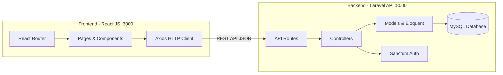
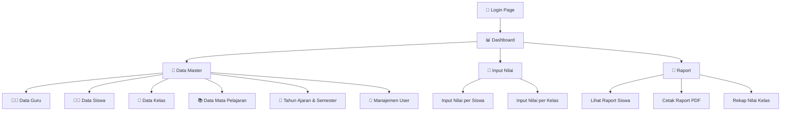
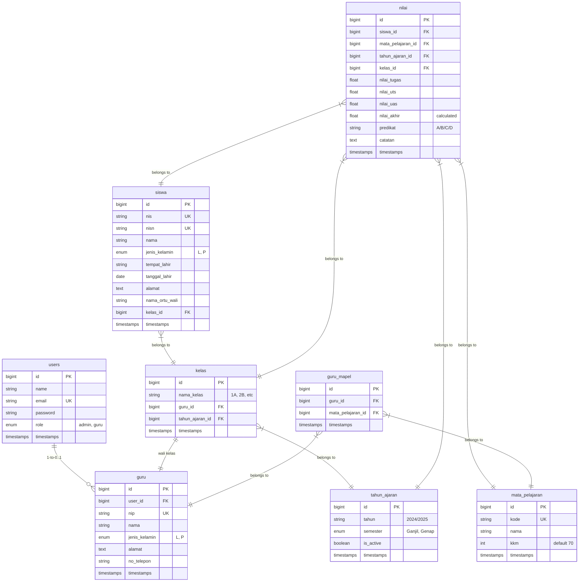

# Aplikasi Raport SD — Implementation Plan

Membangun aplikasi Raport Sekolah Dasar (SD) dengan arsitektur **Microservices**: **Laravel RESTful API** (Backend) + **React JS** (Frontend), menggunakan database **MySQL**.

---

## Ringkasan Arsitektur



| Layer | Teknologi |
|---|---|
| **Backend** | Laravel 13 + Laravel Sanctum (API Token Auth) |
| **Frontend** | React 19 + React Router + Axios |
| **Database** | MySQL |
| **Auth** | Laravel Sanctum (SPA token-based) |
| **Styling** | CSS custom + responsive design |

---

## Alur Bisnis & Fitur Sistem

### Peran Pengguna (Roles)

| Role | Akses |
|---|---|
| **Admin** | CRUD semua data master (guru, siswa, kelas, tahun ajaran, mata pelajaran), manajemen user |
| **Guru / Wali Kelas** | Input nilai siswa, lihat raport per kelas yang diampu, cetak raport |

### Menu & Fitur Aplikasi



### Detail Fitur per Menu

#### 1. 🔐 Autentikasi & Otorisasi
- Login / Logout
- Role-based access control (Admin, Guru)
- Proteksi halaman berdasarkan role
- Token-based authentication (Laravel Sanctum)

#### 2. 📊 Dashboard
- Statistik ringkasan: jumlah siswa, guru, kelas
- Informasi tahun ajaran aktif
- Quick links ke fitur utama

#### 3. 📁 Data Master (Admin Only) — Full CRUD
- **Data Guru**: NIP, nama, jenis kelamin, alamat, no. telepon, mata pelajaran yang diampu
- **Data Siswa**: NIS, NISN, nama, jenis kelamin, tempat & tanggal lahir, alamat, nama orang tua/wali, kelas
- **Data Kelas**: nama kelas (1A, 1B, ..., 6B), wali kelas, tahun ajaran
- **Data Mata Pelajaran**: kode, nama mapel, KKM (Kriteria Ketuntasan Minimal)
- **Tahun Ajaran & Semester**: tahun ajaran (2024/2025), semester (Ganjil/Genap), status aktif
- **Manajemen User**: CRUD user, assign role

#### 4. 📝 Input Nilai (Guru / Admin)
- Pilih kelas → mata pelajaran → semester
- Input nilai: Tugas, UTS, UAS
- Hitung nilai akhir otomatis (bobot: Tugas 30%, UTS 30%, UAS 40%)
- Predikat otomatis (A/B/C/D) berdasarkan range nilai
- Catatan/deskripsi per mata pelajaran

#### 5. 📄 Raport (Guru / Admin)
- Lihat raport per siswa per semester
- Cetak raport (format print-friendly / PDF)
- Rekap nilai seluruh kelas
- Ranking / peringkat kelas

---

## Desain Database (ERD)



---

## Proposed Changes

### Konfigurasi Awal

#### [MODIFY] [.env](file:///f:/Herd/MatkulPBP/TR-PBP/backend-app/.env)
- Ubah `DB_CONNECTION` dari `sqlite` ke `mysql`
- Konfigurasi `DB_HOST`, `DB_PORT`, `DB_DATABASE=raport_sd`, `DB_USERNAME`, `DB_PASSWORD`
- Tambah `FRONTEND_URL=http://localhost:3000` untuk CORS
- Ubah `SESSION_DRIVER` ke `cookie`

#### [MODIFY] [composer.json](file:///f:/Herd/MatkulPBP/TR-PBP/backend-app/composer.json)
- Tambah dependency: `laravel/sanctum` untuk API authentication

#### [MODIFY] [package.json](file:///f:/Herd/MatkulPBP/TR-PBP/frontend-app/package.json)
- Tambah dependencies: `react-router-dom`, `axios`, `react-icons`, `react-toastify`

---

### Backend — Database Migrations

> **7 migration files baru** di `backend-app/database/migrations/`

#### [NEW] `create_guru_table.php`
Tabel `guru`: id, user_id, nip, nama, jenis_kelamin, alamat, no_telepon

#### [NEW] `create_tahun_ajaran_table.php`
Tabel `tahun_ajaran`: id, tahun, semester, is_active

#### [NEW] `create_mata_pelajaran_table.php`
Tabel `mata_pelajaran`: id, kode, nama, kkm

#### [NEW] `create_kelas_table.php`
Tabel `kelas`: id, nama_kelas, guru_id (FK), tahun_ajaran_id (FK)

#### [NEW] `create_siswa_table.php`
Tabel `siswa`: id, nis, nisn, nama, jenis_kelamin, tempat_lahir, tanggal_lahir, alamat, nama_ortu_wali, kelas_id (FK)

#### [NEW] `create_guru_mapel_table.php`
Tabel pivot `guru_mapel`: id, guru_id (FK), mata_pelajaran_id (FK)

#### [NEW] `create_nilai_table.php`
Tabel `nilai`: id, siswa_id, mata_pelajaran_id, tahun_ajaran_id, kelas_id, nilai_tugas, nilai_uts, nilai_uas, nilai_akhir, predikat, catatan

#### [MODIFY] `create_users_table.php`
- Tambah kolom `role` (enum: admin, guru) dengan default 'guru'

---

### Backend — Models

> **6 model baru** + modifikasi User model di `backend-app/app/Models/`

#### [MODIFY] [User.php](file:///f:/Herd/MatkulPBP/TR-PBP/backend-app/app/Models/User.php)
- Tambah `role` ke fillable
- Tambah relasi `guru()`, method `isAdmin()`, `isGuru()`
- Implement HasApiTokens trait (Sanctum)

#### [NEW] `Guru.php`
Relasi: belongsTo User, hasOne Kelas (wali kelas), belongsToMany MataPelajaran

#### [NEW] `TahunAjaran.php`
Relasi: hasMany Kelas, hasMany Nilai. Scope: active()

#### [NEW] `MataPelajaran.php`
Relasi: belongsToMany Guru, hasMany Nilai

#### [NEW] `Kelas.php`
Relasi: belongsTo Guru, belongsTo TahunAjaran, hasMany Siswa, hasMany Nilai

#### [NEW] `Siswa.php`
Relasi: belongsTo Kelas, hasMany Nilai

#### [NEW] `Nilai.php`
Relasi: belongsTo Siswa, belongsTo MataPelajaran, belongsTo TahunAjaran, belongsTo Kelas
Method: hitungNilaiAkhir(), getPredikat()

---

### Backend — API Controllers

> **7 controller baru** di `backend-app/app/Http/Controllers/Api/`

#### [NEW] `AuthController.php`
- `login()` — validasi credentials, return Sanctum token
- `logout()` — revoke token
- `me()` — return authenticated user data

#### [NEW] `DashboardController.php`
- `index()` — return statistik (jumlah siswa, guru, kelas, tahun ajaran aktif)

#### [NEW] `GuruController.php`
- Full CRUD: `index`, `store`, `show`, `update`, `destroy`
- Validasi NIP unik, format data

#### [NEW] `SiswaController.php`
- Full CRUD: `index`, `store`, `show`, `update`, `destroy`
- Filter per kelas
- Search by nama/NIS

#### [NEW] `KelasController.php`
- Full CRUD: `index`, `store`, `show`, `update`, `destroy`
- Include relasi wali kelas & tahun ajaran

#### [NEW] `MataPelajaranController.php`
- Full CRUD: `index`, `store`, `show`, `update`, `destroy`

#### [NEW] `TahunAjaranController.php`
- Full CRUD: `index`, `store`, `show`, `update`, `destroy`
- Toggle `is_active`

#### [NEW] `NilaiController.php`
- `index()` — list nilai per kelas per mapel per semester
- `store()` / `update()` — input/edit nilai (auto-calculate nilai_akhir & predikat)
- `raport()` — get all nilai untuk 1 siswa 1 semester (raport view)
- `rekap()` — rekap & ranking per kelas

---

### Backend — Middleware & Routes

#### [NEW] `app/Http/Middleware/RoleMiddleware.php`
- Cek role user (admin/guru) untuk proteksi endpoint

#### [NEW] `routes/api.php`
```
POST   /api/login
POST   /api/logout

(auth:sanctum)
GET    /api/me
GET    /api/dashboard

(admin only)
CRUD   /api/guru
CRUD   /api/siswa
CRUD   /api/kelas
CRUD   /api/mata-pelajaran
CRUD   /api/tahun-ajaran
CRUD   /api/users

(guru & admin)
GET    /api/nilai
POST   /api/nilai
PUT    /api/nilai/{id}
GET    /api/raport/{siswa_id}
GET    /api/rekap/{kelas_id}
```

#### [NEW] `config/cors.php`
- Allow frontend origin (`http://localhost:3000`)
- Allow credentials

---

### Backend — Seeders

#### [NEW] `database/seeders/DatabaseSeeder.php`
- Seed admin user default (admin@raportsd.com / password)
- Seed sample: guru, tahun ajaran, mata pelajaran SD (PKn, B.Indonesia, Matematika, IPA, IPS, SBK, PJOK, B.Inggris, Agama)
- Seed sample kelas & siswa

---

### Frontend — Struktur Folder

```
frontend-app/src/
├── api/
│   └── axios.js                  # Axios instance + interceptors
├── context/
│   └── AuthContext.js            # React Context for auth state
├── components/
│   ├── Layout/
│   │   ├── Sidebar.js            # Navigation sidebar
│   │   ├── Header.js             # Top header bar
│   │   └── MainLayout.js         # Layout wrapper
│   ├── common/
│   │   ├── DataTable.js          # Reusable table component
│   │   ├── Modal.js              # Reusable modal
│   │   ├── ConfirmDialog.js      # Delete confirmation
│   │   ├── LoadingSpinner.js     # Loading state
│   │   └── ProtectedRoute.js     # Route guard by role
│   └── forms/
│       ├── GuruForm.js
│       ├── SiswaForm.js
│       ├── KelasForm.js
│       ├── MapelForm.js
│       ├── TahunAjaranForm.js
│       └── NilaiForm.js
├── pages/
│   ├── Login.js
│   ├── Dashboard.js
│   ├── guru/
│   │   ├── GuruList.js
│   │   └── GuruDetail.js
│   ├── siswa/
│   │   ├── SiswaList.js
│   │   └── SiswaDetail.js
│   ├── kelas/
│   │   └── KelasList.js
│   ├── mapel/
│   │   └── MapelList.js
│   ├── tahun-ajaran/
│   │   └── TahunAjaranList.js
│   ├── nilai/
│   │   └── InputNilai.js
│   ├── raport/
│   │   ├── RaportView.js
│   │   └── RekapNilai.js
│   └── users/
│       └── UserList.js
├── styles/
│   ├── index.css                 # Global styles & design tokens
│   ├── login.css
│   ├── dashboard.css
│   ├── sidebar.css
│   ├── table.css
│   ├── form.css
│   ├── modal.css
│   └── raport.css
├── App.js                        # Router setup
└── index.js                      # Entry point
```

---

### Frontend — Core Setup

#### [NEW] `src/api/axios.js`
- Base URL: `http://localhost:8000/api`
- Interceptor: attach Bearer token dari localStorage
- Handle 401 → redirect ke login

#### [NEW] `src/context/AuthContext.js`
- Simpan user data & token di state + localStorage
- Provide `login()`, `logout()`, `isAdmin`, `isGuru`

#### [MODIFY] [App.js](file:///f:/Herd/MatkulPBP/TR-PBP/frontend-app/src/App.js)
- Setup React Router dengan semua routes
- Wrap dengan AuthProvider
- Proteksi routes berdasarkan role

---

### Frontend — Pages (19 halaman)

| Page | Deskripsi | Role |
|---|---|---|
| **Login** | Halaman login dengan email & password | Public |
| **Dashboard** | Statistik & overview | Admin, Guru |
| **GuruList** | Tabel data guru + tombol CRUD | Admin |
| **GuruDetail** | Detail info guru | Admin |
| **SiswaList** | Tabel data siswa, filter per kelas | Admin |
| **SiswaDetail** | Detail info siswa | Admin |
| **KelasList** | Tabel data kelas + assign wali kelas | Admin |
| **MapelList** | Tabel mata pelajaran + KKM | Admin |
| **TahunAjaranList** | Kelola tahun ajaran & semester | Admin |
| **UserList** | Manajemen user & role | Admin |
| **InputNilai** | Form input nilai per kelas/mapel | Guru, Admin |
| **RaportView** | Tampilan raport siswa (print-ready) | Guru, Admin |
| **RekapNilai** | Rekap & ranking nilai per kelas | Guru, Admin |

---

### Frontend — Design System

- **Color Palette**: Dark navy sidebar + clean white content area + blue accent
- **Typography**: Google Fonts (Inter)
- **Components**: Cards dengan shadow, rounded corners, smooth transitions
- **Animations**: Fade-in page transitions, hover effects pada tabel & tombol
- **Responsive**: Sidebar collapsible, tabel scrollable di mobile
- **Print**: Raport page dengan CSS `@media print` untuk cetak

---

## User Review Required

> [!IMPORTANT]
> **Pilihan Database**: Plan ini menggunakan **MySQL**. Jika ingin tetap menggunakan **SQLite** (yang sudah ter-setup), bisa disesuaikan tanpa perubahan besar. Konfirmasi database mana yang diinginkan.

> [!IMPORTANT]
> **Laravel Sanctum**: Untuk API authentication, saya akan menggunakan **Laravel Sanctum** dengan token-based auth. Ini adalah standar untuk SPA + API di Laravel.

> [!WARNING]
> **Perubahan `.env`**: File `.env` akan dimodifikasi untuk koneksi MySQL. Pastikan MySQL server sudah terinstall dan berjalan di local machine.

## Open Questions

1. **Database**: Apakah ingin menggunakan **MySQL** (rekomendasi untuk production) atau tetap **SQLite** (lebih simple untuk development)?

2. **Bobot Nilai**: Apakah bobot nilai (Tugas 30%, UTS 30%, UAS 40%) sudah sesuai, atau ingin bisa dikustomisasi per mata pelajaran?

3. **Cetak Raport**: Apakah cukup menggunakan **CSS print** (window.print()) atau butuh generate **PDF** menggunakan library (lebih kompleks)?

4. **Data Awal (Seeder)**: Apakah perlu saya buatkan seeder dengan contoh data lengkap (guru, siswa, nilai) untuk demo, atau cukup admin user saja?

5. **Mata Pelajaran SD**: Apakah daftar berikut sudah sesuai?
   - Pendidikan Agama
   - PKn
   - Bahasa Indonesia
   - Matematika
   - IPA
   - IPS
   - Seni Budaya & Keterampilan (SBK)
   - PJOK
   - Bahasa Inggris

---

## Verification Plan

### Automated Tests
```bash
# Backend - Jalankan migrations & seeders
cd backend-app
php artisan migrate:fresh --seed

# Backend - Run Laravel tests
php artisan test

# Frontend - Start dev server
cd frontend-app
npm start
```

### Manual Verification
1. **Auth Flow**: Login sebagai Admin → cek semua menu muncul. Login sebagai Guru → cek menu terbatas.
2. **CRUD Test**: Untuk setiap data master → Create, Read, Update, Delete → verifikasi data berubah di tabel.
3. **Input Nilai**: Input nilai siswa → cek kalkulasi nilai akhir & predikat otomatis.
4. **Raport View**: Buka raport siswa → cek tampilan semua nilai per semester → coba print.
5. **API Test**: Cek semua endpoint via browser/Postman, pastikan response JSON benar.
6. **Responsive**: Test di berbagai ukuran layar (desktop, tablet, mobile).

---

## Estimasi Jumlah File

| Kategori | Jumlah File |
|---|---|
| Backend — Migrations | 7 baru + 1 modify |
| Backend — Models | 6 baru + 1 modify |
| Backend — Controllers | 8 baru |
| Backend — Middleware | 1 baru |
| Backend — Routes | 1 baru |
| Backend — Config | 2 modify |
| Backend — Seeders | 1 baru |
| Frontend — Pages | ~15 baru |
| Frontend — Components | ~10 baru |
| Frontend — Styles | ~8 baru |
| Frontend — Core | ~3 baru + 2 modify |
| **Total** | **~65 files** |
